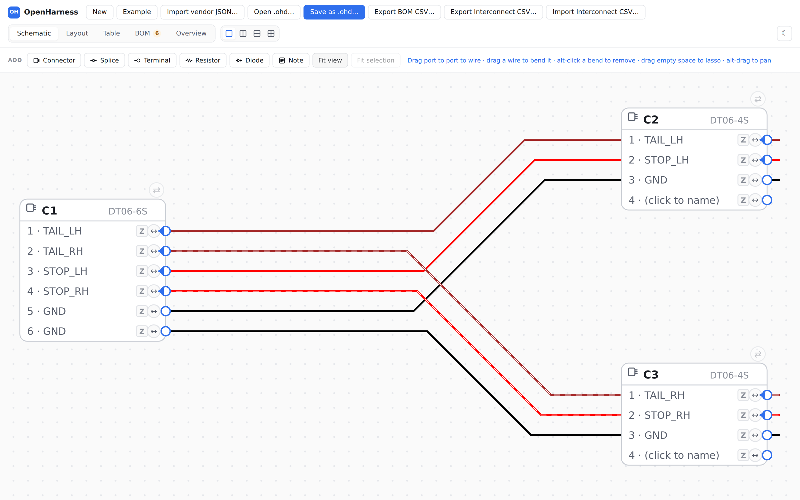
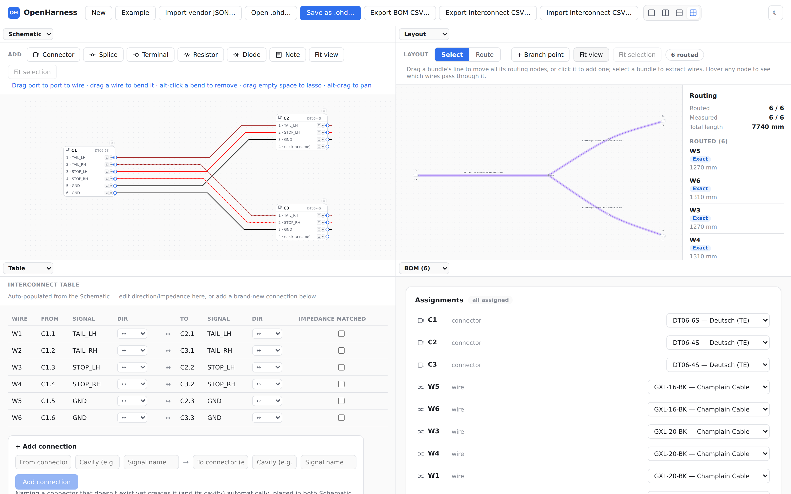
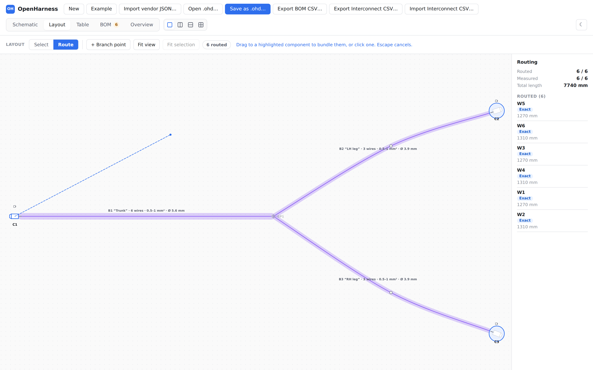

# OpenHarness

**Wire harness CAD that runs on your machine, saves to a file you can diff,
and lets your own code drive it.**

Harness design tools are hosted subscription products. That rules them out
entirely for anyone whose harness IP cannot leave the network, puts your
drawings in someone else's store instead of the version control you already
run, and leaves no seam for your own scripts. OpenHarness is the other
option: a real desktop application, MIT licensed, with a documented
git-diffable file format and a CLI that can check a harness in CI.



Four panes over one document model. Edit any of them and the rest follow.



- Full design spec: [`docs/HARNESS-DESIGNER-SPEC.md`](docs/HARNESS-DESIGNER-SPEC.md)
- Review notes and open decisions: [`docs/SPEC-REVIEW-RECOMMENDATIONS.md`](docs/SPEC-REVIEW-RECOMMENDATIONS.md)
- Running build log / session context: [`docs/00-SESSION-CONTEXT.md`](docs/00-SESSION-CONTEXT.md)

## Try it in two minutes

Take an installer from the [Releases
page](https://github.com/connordunham/openharness/releases) — no Node, no
build toolchain needed. Full install notes are [below](#install-it).

Then open the example harness: **Open example harness** on the start screen,
or **Example** in the toolbar. That loads
[`examples/tail-lamp-loom.ohd`](examples/tail-lamp-loom.ohd) — a rear lamp
loom with three connectors, six wires and a branch point, already routed —
so every pane has something in it from the first click.

> The bundled example arrives in the next release. On `v0.1.0` you can still
> open it: download
> [`examples/tail-lamp-loom.ohd`](examples/tail-lamp-loom.ohd) from this repo
> and use **Open .ohd…**.

## Status

**There is a real, running GUI with working Schematic and Layout canvases.**
`@openharness/app` is an Electron desktop app (decision: Electron over Tauri —
same TypeScript/Node codebase as `@openharness/core`/`io`, no IPC boundary
between the app and automation scripts that need `fs`/`child_process`).

Panes that work today:

- **Schematic** — real symbols for every component type (connector housings by
  shape, splice, terminal, branch point, resistor, diode, cable), 45°-diagonal
  auto-routing with **drag-to-bend** manual override, marquee (lasso) and
  shift-click multi-select across wires, groups and components, wire groups
  (twist / cable) with an explicit twisted flag, shields with a user-positioned
  wrap, per-end terminations and a wirable termination node, optional connector
  backshell (BS) terminations, and cross-pane hover highlighting.
- **Layout** — connector/component glyphs with auto-orientation and auto-place,
  flowy bundle routing with per-segment lengths, bundle waypoints, signal-name
  hover tooltips, a closable bundle card, and pass-through resistors/diodes
  drawn inline on the merged bundle line. A **Select / Route** tool switcher
  (`V` / `C`), and a routing sidebar that leads with route health — how many
  wires have a path through the bundle graph, how many have a measured rather
  than estimated length, and which ones still need routing.
- **Table** — an interconnect table that is bidirectional with the Schematic:
  edit either and the other follows. CSV import/export, per-signal direction
  (in / out / bidirectional) and an impedance-matched flag with a triangle
  indicator at each pin.
- **Parts / BOM** — shared part fields across every part kind (manufacturer PN,
  vendor PN, link, cost) plus a repeatable, user-extensible **parameter list**
  (`{name, min/max/nom/typ/abs, value, unit}`) replacing the old single
  max-rating slot; grouped BOM with populated-cavity contact and seal rollup,
  CSV export.
- **Diagnostics** — live DRC output from the derive pipeline.

Layout pans by click-drag; Schematic reserves left-drag on empty canvas for
the marquee, so it pans with alt-drag or the middle button. Both zoom on the
mouse wheel (pinch on a trackpad) and have fit-to-view and fit-to-selection.

Verified by actually building and launching the app on Windows and driving it
with real mouse input — not just typechecked. That process caught a real bug
early on: the preload script (the bridge between the sandboxed renderer and the
main process) was compiled as ESM, but Electron's sandboxed preload context
doesn't reliably run ES modules, so the `contextBridge` call silently never
executed and every button threw `Cannot read properties of undefined (reading
'pickFile')`. Fixed by forcing the preload script to compile as CommonJS via
TypeScript's `.cts` source extension, independent of the package's
`"type": "module"`. No unit test or typecheck could have caught that — it only
shows up when the built app is actually run.

### Derived model

`@openharness/core` has a real, tested implementation of the whole derived
model (spec §6):

- **Net extraction** (`derive/netExtraction.ts`) — union-find over cavities,
  splices (n-ary hyper-nodes), two-terminal sides (resistor/diode — kept
  separate, not unioned), cable cores/shield, and free ends; global-signal
  merging and signal-propagation/conflict detection.
- **Routing** (`derive/routing.ts`) — Dijkstra over the layout graph with
  deterministic tie-breaking, frozen-route validation, recursive splice-host
  resolution (with a visited-set to terminate chains), and the cable
  core/shield short-circuit (`jumper`/`shield` statuses, never `noRoute`).
- **Length** (`derive/length.ts`, `derive/bundleLength.ts`) — integer-micrometre
  summation, service loops, strip-length allowances, `lengthOverride`, and
  per-segment authored bundle lengths.
- **BOM** (`derive/bom.ts`) — grouped by part, with populated-cavity
  contact/seal rollup. Configuration-accessory rollup and length-based
  covering pricing are explicitly deferred — see the comment at the top of
  the file for why.
- **Interconnect** (`derive/interconnect.ts`) — one row per wire, with each
  endpoint's declared direction folded into a single resolved direction and a
  `conflict` value surfaced rather than guessed.
- **Parasitics** (`derive/parasitics.ts`) — per-wire R and C from the wire
  part's per-unit-length figures times the derived length, carrying a
  `lengthKnown` flag so an unrouted wire reports "unknown" rather than a
  confident zero. Components carry their own optional R/C/L, hidden behind a
  project-level "show parasitics" setting.
- **DRC** (`derive/rules.ts`) — 9 of the 16 built-in rules from spec §6.5 (the
  rest need part-catalogue detail or formboard geometry no fixture exercises
  yet).

### I/O and CLI

`@openharness/io` has a working vendor wire-format v0.8 JSON importer
(`importVendorJson.ts`, spec §11), tested against both real captured
exports — not synthetic data. It also has `.ohd` save/load with stable,
alphabetically-sorted keys for clean git diffs (spec §10), BOM CSV export
(spec §9), interconnect CSV import/export, and diagnostics JSON/text
formatting.

**The CLI is real, not a placeholder.** `openharness import`, `validate`, and
`export --bom` (spec §8.6) work end to end — verified both with unit tests and
by running the built CLI as a subprocess against the real reference export:

```
$ openharness import reference-harness.json -o out.ohd --name "Smoke Test"
Wrote out.ohd
$ openharness validate out.ohd --fail-on error
[ERROR] OVERFILLED_CAVITY: C3 cavity _blVGl has 2 wires without a splice (cavity:ZWfYpO:_blVGl)
... (exit code 1)
$ openharness export out.ohd --bom bom.csv
Wrote bom.csv
```

That OVERFILLED_CAVITY error is itself a real finding: the actual reference
document has a connector used as an in-line jumper — two wires per cavity, no
splice. It was flagged in a comment in `rules.ts` rather than silently
special-cased away, and the project's harness engineer has since ruled on it:
the rule is right and the document is wrong, regardless of whether the combined
gauge would fit the contact. See [`docs/DOMAIN-DECISIONS.md`](docs/DOMAIN-DECISIONS.md)
D1. Rules that have not yet been through that process are marked as
unvalidated rather than presented as established practice.

**626 tests pass** across `core`, `parts`, `io`, `cli`, `render` and `app`.
Along the way, fixing a Map-iteration-order false positive in the `.ohd`
round-trip test surfaced a real (if minor) issue: BOM/diagnostics/nets output
order depended on incidental object-insertion order, which would have made
exported CSVs and golden-file diffs non-reproducible for no functional reason —
`computeDerivedModel` now sorts all three deterministically, with a dedicated
regression test.

Still not built: PDF/XLSX/WireViz export, the automation host, the MCP server,
and the CLI's `run`/`query`/`diff`/`doctor` commands. See
[`docs/HARNESS-DESIGNER-SPEC.md`](docs/HARNESS-DESIGNER-SPEC.md) §12 for the
phase plan.

## Layout

```
packages/
  core/         @openharness/core        — document model, store, derive pipeline
  io/           @openharness/io          — vendor JSON import, .ohd save/load, BOM + interconnect CSV
  cli/          openharness              — import / validate / export --bom
  app/          @openharness/app         — Electron desktop app: Schematic, Layout, Table, Parts, Diagnostics
  render/       @openharness/render      — SVG scene builders shared by the canvases
  parts/        @openharness/parts       — SQLite master parts library: versioning, suppliers, price history
  automation/   @openharness/automation  — plugin host (TODO, Phase 5)
  mcp/          @openharness/mcp         — local MCP server (TODO, Phase 5)
automations/    — your own automations live here (spec §8.2)
docs/           — design spec, review notes, session context
examples/       — the bundled example harness (File > Example)
fixtures/       — golden-file test documents (spec §13)
```

## Install it

**You do not need Node.js, npm, or a build toolchain to use OpenHarness.**
Download one file from the [Releases
page](https://github.com/connordunham/openharness/releases) and run it.

| If you are on | Take |
|---|---|
| Windows | `OpenHarness-Setup-*.exe` — the normal installer |
| Windows, without admin rights | `OpenHarness-*-portable-*.exe` — one file, installs nothing, writes no registry keys |
| Linux | `OpenHarness-*.AppImage` (`chmod +x` it, then run it) or the `.deb` |
| macOS, Apple silicon | `OpenHarness-*-arm64.dmg` |
| macOS, Intel | `OpenHarness-*-x64.dmg` |

These builds are **not code-signed**, because signing certificates cost money
this project does not have. The consequence is a scary-looking warning on
first launch, and nothing else:

- **Windows** — SmartScreen says "Windows protected your PC". Click *More
  info*, then *Run anyway*.
- **macOS** — Gatekeeper refuses to open it. Right-click the app and choose
  *Open*, then *Open* again in the dialog. You only do this once.
- **Linux** — no warning, but AppImages need the executable bit:
  `chmod +x OpenHarness-*.AppImage`.

That is the whole installation. Everything below this point is for people who
want to **change** the code.

---

## Build from source

Only necessary if you intend to modify OpenHarness. If you just want to run
it, use an installer above — building from source is strictly more work and
gets you the same application.

### 1. Node.js

Install **Node.js 22 LTS** from [nodejs.org](https://nodejs.org). Take the
LTS installer and accept every default. That is genuinely all the
configuration there is — if you find yourself editing PATH by hand, something
has gone wrong and the doctor below will say what.

Node 20.19 or newer will work; 22 is what CI uses and what `.nvmrc` pins. If
you already run [nvm](https://github.com/nvm-sh/nvm) or
[nvm-windows](https://github.com/coreybutler/nvm-windows), `nvm use` picks up
`.nvmrc` on its own.

### 2. Clone and build

```bash
git clone https://github.com/connordunham/openharness.git
cd openharness
npm install     # also compiles the workspace libraries — see below
npm start       # builds the app and launches it
```

Use **npm**, not pnpm or yarn. `pnpm-workspace.yaml` is checked in but there
is no pnpm lockfile, so pnpm resolves a different dependency tree than the one
CI builds against.

On Windows, clone somewhere **outside OneDrive**. OneDrive replaces unsynced
files with reparse points, which breaks builds in ways that look like random
file-not-found errors.

### 3. When it goes wrong, ask the repo

```bash
npm run doctor
```

This checks the things that have actually broken on real machines — Node
version, a half-downloaded Electron binary, unbuilt workspace libraries, a
stray pnpm lockfile, PowerShell's execution policy, OneDrive — and prints the
exact command that fixes each one. Run it before reading any stack trace.

### Why `npm install` compiles things

`@openharness/core`, `io` and `render` are consumed through their **built
output** — their `package.json` says `main: ./dist/index.js`. On a fresh clone
`dist/` does not exist, so anything that imports them fails until they have
been compiled once:

```
[commonjs--resolver] Failed to resolve entry for package "@openharness/core".
The package may have incorrect main/module/exports specified in its package.json.
```

That error means unbuilt libraries, not a broken dependency, and reinstalling
`node_modules` alone will not fix it. `npm install` runs `tsc -b` through
npm's `prepare` hook, and `npm test` / `npm run build` / `npm start` each build
what they need first, so you should never see it. If you do, `npm run build`.

If you change the build graph, verify with an actual fresh `git clone` into a
new directory rather than a clean build in your existing one. This has broken
clone-and-run twice.

### Everyday commands

Run these from the repo root. Each one builds whatever it needs first.

| Command | What it does |
|---|---|
| `npm start` | Build and launch the desktop app |
| `npm run dev` | Vite dev server + Electron with watch-mode rebuilds |
| `npm test` | 626 tests (`vitest run`) |
| `npm run typecheck` | `tsc -b` across the project references |
| `npm run lint` | ESLint |
| `npm run build` | Compile every package and bundle the renderer |
| `npm run doctor` | Diagnose a broken environment |
| `npm run build:example` | Regenerate `examples/tail-lamp-loom.ohd` |
| `npm run clean` | Delete all build output — for when a stale build misleads you |
| `npm run package` | Build installers for your current OS into `release/` |

Working on one package? `npm test -- packages/core` narrows the test run, and
`npm run build --workspace @openharness/core` builds a single package.

### Building installers yourself

```bash
npm run package          # your current platform
npm run package:win      # or :linux, or :mac
```

Output lands in `release/` — an NSIS installer and a portable `.exe` on
Windows, an AppImage and `.deb` on Linux, `.dmg` and `.zip` on macOS. You can
only build macOS installers on macOS; the Windows and Linux targets cross-build
from anywhere.

**On Windows, packaging needs Developer Mode enabled** (Settings → System → For
developers). electron-builder unpacks a signing toolchain containing symlinks,
and Windows refuses to create those without Developer Mode or admin rights.
The failure reads `Cannot create symbolic link: A required privilege is not
held by the client`, which does not sound like what it is. `npm run doctor`
checks for this.

In practice you should not need to package anything locally — tagging a
release builds all three platforms in CI (`.github/workflows/release.yml`) and
attaches the files to a GitHub Release:

```bash
git tag v0.1.0 && git push origin v0.1.0
```

### If something still goes wrong

`npm run doctor` covers most of it. The rest:

- **`Failed to resolve entry for package "@openharness/…"`** — unbuilt
  libraries. `npm run build`.
- **Anything odd after switching branches** — `npm run clean && npm install`.
  `tsc -b` is incremental and trusts `tsconfig.tsbuildinfo`; a branch switch
  can leave that stale.
- **`npm ci` fails** — use `npm install`. `npm ci` demands the lockfile match
  `package.json` exactly, which it will not while you are adding dependencies.
- **`electron: not found`, or the app never opens a window** — the ~100 MB
  Electron binary download failed and left nothing behind to retry from. Run
  `node node_modules/electron/install.js`, or delete `node_modules` and
  `npm install` again. Behind a corporate proxy or firewall, set
  `ELECTRON_MIRROR` to an internal mirror — or stop fighting it and use the
  prebuilt installer.
- **Windows: `cannot be loaded because running scripts is disabled`** — that
  is PowerShell's execution policy blocking `npm.ps1`. Run the command from
  `cmd.exe`, or use `npm.cmd`, or fix it once with
  `Set-ExecutionPolicy -Scope CurrentUser RemoteSigned`. Worth doing: this
  failure mode can make a build that did nothing look like a build that
  passed.

### Where to start reading

`packages/core/src/types.ts` is the document model and `packages/core/src/store.ts`
is the transaction/undo layer — everything else builds on those two. The
derive pipeline in `packages/core/src/derive/` is the next layer up, and
`packages/app/src/SchematicCanvas.tsx` is the largest UI surface.

[`CONTRIBUTING.md`](CONTRIBUTING.md) has the conventions that matter and how
to send a patch.

## Roadmap

- [`docs/TECHNICAL-ROADMAP.md`](docs/TECHNICAL-ROADMAP.md) — milestones,
  strategy and risks, at the level a stakeholder needs.
- [`docs/ROADMAP.md`](docs/ROADMAP.md) — the feature gap analysis and phasing.
- [`docs/HANDOFF.md`](docs/HANDOFF.md) — how to work in this repo: the
  decisions that are already settled, the conventions, and what "done" means.
- [`docs/tasks/`](docs/tasks/) — the plan broken into self-contained packets,
  each with its contract, acceptance tests and known traps. Start at
  [`docs/tasks/README.md`](docs/tasks/README.md) for the order.
- [`docs/agents/`](docs/agents/) — briefs for the scoped agents that do the
  work: implement, review, verify, audit, maintain.

Shipped since the last roadmap, closing **M1 ("Trustworthy") in
`docs/TECHNICAL-ROADMAP.md`**: connector and terminal **mates** with
cavity-count/gender/size validation — the gap that made a bulkhead's two
halves come out as electrically separate nets — **wire-gauge-vs-contact
checking** with the mm² summation rule, **zoom** with fit-to-view and
fit-to-selection, plus rotate, cavity insert/delete and jumper wires. Before
those: a repeatable part parameter list replacing the single max-rating slot;
parasitics on components and per-unit-length R/C on wire parts; marquee and
shift-click multi-select; twisted decoupled from group kind with an IEEE 315 /
IEC 60617-3 setting; the shield overhaul (positioned wrap, per-end
terminations, a wirable termination node, backshell BS contacts, and a costing
model that decides whether the shield gets a BOM line); and a SQLite master
parts library with part versioning, suppliers and price history.

Most recently, both canvases got a **shared routing gesture**: wires and
bundles are both drawn either by dragging from one port to another or by
clicking both ends, with a live preview of what you are about to create,
highlighting on the targets that would actually accept it, and Escape to
cancel.



Next, in order — see `docs/ROADMAP.md` for the reasoning and the full table:

1. **Typed part properties** — contact, terminal, splice, diode and resistor
   fields, kept alongside the open `parameters[]` list rather than replacing
   it, because validation needs typed fields and datasheets need open ones.
2. **Current capacity and bend radius** — the two rules the resident harness
   engineer named as the highest-value missing checks (`docs/DOMAIN-DECISIONS.md` D4).
3. **Output** — PDF with a title block, XLSX wiring table with per-connector
   pinout sheets, and vendor JSON export to match the existing importer. This
   is the adoption threshold: until it lands, a harness designed here cannot
   be handed to someone who will build it.
4. **Bulk editing** — global search, type-to-connect destinations, select-wires-
   on-net, auto-layout, add-splice-from-selection, inline connectors, groups.
5. **Formboard** — 1:1 scale layout, panel grid, bend radii, to-scale
   snapping, per-panel PDF.
6. **Automation surface** — the MCP server, the automation host, and the CLI's
   `run`/`query`/`diff`/`doctor`.

Also outstanding: **dependency upgrades** — Electron 31, Vite 5 and Vitest 2
all carry open advisories; all are dev/build-time except Electron, which ships.

Deliberately not pursued: teams, seats, billing, cloud sharing and embedding,
accounts, live multi-user sync, and mobile viewing — all consequences of a
hosted subscription product, which OpenHarness is not. See the roadmap's
Non-goals section.

## Open decisions

Five decisions remain open from the review document's closing summary and
should be made deliberately before the canvas work goes deeper:

1. Variants / configurable harnesses — in or out of v1, as an explicit ADR (R3)
2. Directory file format's atomic-write story (R11)
3. Derived-model invalidation contract (R9)
4. Rough NFR numbers — target doc size, startup budget (R25)
5. PDF export spike, before the UI assumes it works (R20)

## Contributing

Contributions are welcome — [`CONTRIBUTING.md`](CONTRIBUTING.md) has the build
invariants, the conventions that actually matter, and how to send a patch. If
you want something to pick up, [`docs/tasks/`](docs/tasks/) holds self-contained
packets with acceptance criteria.

Harness engineering questions are especially welcome. Settled ones live in
[`docs/DOMAIN-DECISIONS.md`](docs/DOMAIN-DECISIONS.md); open ones are listed at
the bottom of that file.

- [`CODE_OF_CONDUCT.md`](CODE_OF_CONDUCT.md)
- [`SECURITY.md`](SECURITY.md) — please report vulnerabilities privately

## Disclaimer

OpenHarness produces documentation for things that get built and energised.
The design-rule checks are an aid, not an assurance: some are validated
against a standard, some implement a recorded engineering decision, and some
are explicitly unvalidated inference. **Nothing this tool outputs replaces
engineering review.** Check the harness, not just the absence of a diagnostic.

## License

MIT — see [`LICENSE`](LICENSE). No CLA; contributors keep their copyright and
sign off commits under the [DCO](https://developercertificate.org/).
